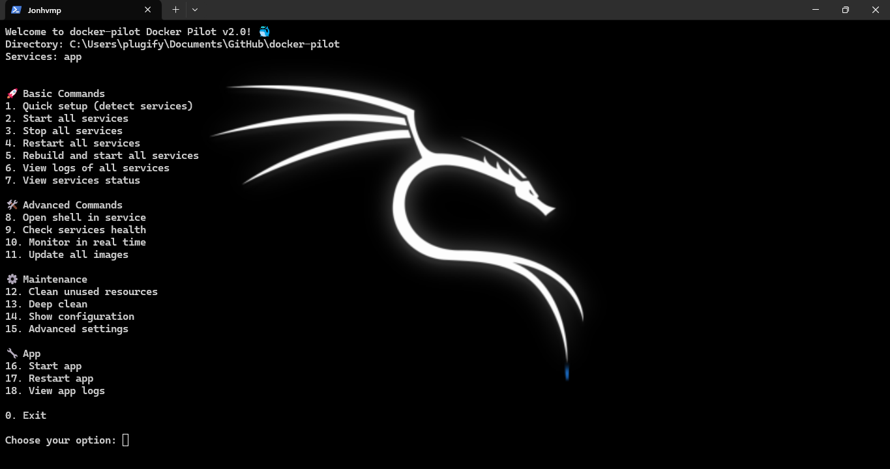
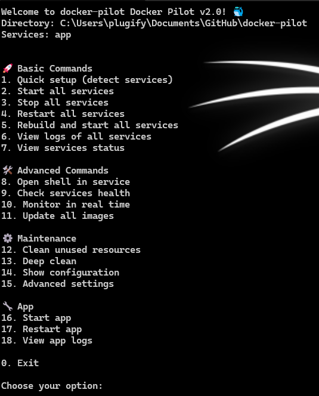

# Docker Pilot 🐳

<div align="center">



**A powerful and scalable npm library for managing Docker applications of any size.**

[](https://badge.fury.io/js/docker-pilot)
[](https://www.typescriptlang.org/)
[](https://www.docker.com/)
[](https://opensource.org/licenses/ISC)

[📚 **Complete Documentation**](https://Jonhvmp.github.io/docker-pilot/) • [🚀 **Quick Start**](#-quick-start) • [🎮 **Interactive Menu**](#-interactive-menu)

---

</div>

## ✨ What is Docker Pilot?

Docker Pilot is a modern TypeScript library that makes Docker container management **simple**, **powerful**, and **fun**. From small projects to enterprise systems, it provides an intuitive CLI and programmatic API.

### 🎯 Key Features

- 🎮 **Interactive Terminal Menu** - Navigate commands with ease
- 📄 **Smart Compose Management** - Recursive discovery and analysis of docker-compose files
- 🎯 **Intelligent Project Detection** - Auto-detect compose files with smart prioritization
- 🌍 **Multi-language Support** - Portuguese & English with complete i18n
- 📦 **TypeScript Native** - Full type safety and IntelliSense
- ⚡ **Zero Configuration** - Works out of the box
- 🔌 **Plugin System** - Extensible architecture
- 📊 **Real-time Monitoring** - Status, logs, and metrics
- 🔍 **Advanced File Analysis** - Validate, analyze, and manage compose files

## 🚀 Quick Start

### Installation

```bash
# Install globally for CLI
npm install -g docker-pilot

# Or locally for your project
npm install docker-pilot
```

### CLI Usage

```bash
# Start interactive menu
docker-pilot

# Or use direct commands
docker-pilot up              # Start all services
docker-pilot status          # Check status
docker-pilot logs app        # View logs
docker-pilot compose list    # List all compose files
docker-pilot compose analyze # Analyze compose structure
docker-pilot compose validate # Validate compose files
```

### As Library

```typescript
import { DockerPilot } from 'docker-pilot';

const pilot = new DockerPilot();
await pilot.initialize();
await pilot.up();              // Start services
const status = await pilot.status();  // Get status
```

## � What's New in v2.0.4

### 📄 Enhanced Docker Compose Management

Docker Pilot now provides **comprehensive docker-compose file management** with intelligent discovery:

```bash
# List all compose files recursively
docker-pilot compose list --variants

# Analyze compose file structure
docker-pilot compose analyze docker-compose.yml

# Validate compose files
docker-pilot compose validate

# Find compose files in complex projects
docker-pilot compose find /path/to/project
```

**Smart Discovery Features:**
- 🔍 **Recursive Search**: Finds compose files up to 6 levels deep
- 🎯 **Smart Prioritization**: Identifies main files vs. environment variants
- 📊 **Detailed Analysis**: Shows services, ports, dependencies, and file info
- 🌍 **Environment Detection**: Recognizes dev, prod, test variants automatically
- ✅ **Real-time Validation**: Syntax and structure validation with detailed reports

### 🎯 Intelligent Project Auto-Detection

Starting Docker Pilot now automatically detects your project structure:

```
🔍 Searching for docker-compose files recursively...
📁 Search depth: 6 levels

Found 3 docker-compose files:

1. docker-compose.yml 🎯📁
   📏 2.1 KB | 📅 22/06/2025
   🛠️ 4 services: web, api, database, redis

2. backend/docker-compose.dev.yml (development) 📂(2)
   📏 1.8 KB | 📅 21/06/2025
   🛠️ 2 services: api-dev, database-dev
```

## �🎮 Interactive Menu

Docker Pilot's standout feature is its **interactive terminal menu** that makes Docker management intuitive:



```bash
$ docker-pilot

🐳 My Project - Docker Pilot v2.0 🐳

🚀 Basic Commands:
1. Start all services
2. Stop all services
3. Restart all services
4. Rebuild and start all services
5. View logs of all services
6. View services status

🛠️ Advanced Commands:
7. Open shell in service
8. Check services health
9. Monitor in real time
10. Update all images

⚙️ Maintenance:
11. Clean unused resources
12. Deep clean
13. Show configuration

🔧 App:
14. Start app
15. Restart app
16. View app logs

Choose your option: ■
```

### Language Support

Docker Pilot automatically detects your system language and provides full localization:

- 🇺🇸 **English** - Complete interface
- 🇧🇷 **Português** - Interface completa

Switch languages on-the-fly through the advanced settings menu!

## 📋 Requirements

- **Node.js** >= 18.0.0
- **Docker** >= 20.0.0
- **Docker Compose** >= 2.0.4

## 🎯 Use Cases

**👨‍💻 Developers**
- Quick project setup
- Development workflow automation
- Multi-service management
- Interactive debugging

**🏢 Teams & Enterprise**
- Standardized Docker workflows
- Multi-environment support
- Automated backups
- Performance monitoring

## 🔧 Configuration

Docker Pilot works with zero configuration, but you can customize it:

```json
{
  "projectName": "My Amazing App",
  "language": "en", // or "pt-br"
  "services": {
    "app": {
      "port": 3000,
      "description": "Main application"
    },
    "database": {
      "port": 5432,
      "description": "PostgreSQL database"
    }
  }
}
```

## 🌟 Why Choose Docker Pilot?

<div align="center">

| 🐳 **Native Docker** | 🎮 **Interactive** | 🌍 **Global** | 🚀 **Modern** |
|:---:|:---:|:---:|:---:|
| Built specifically for Docker workflows | Terminal UI that's actually enjoyable | Multi-language from day one | TypeScript, ES6+, latest standards |

| 🔌 **Extensible** | 📊 **Intelligent** | 🛡️ **Reliable** | ⚡ **Fast** |
|:---:|:---:|:---:|:---:|
| Plugin system for custom needs | Auto-detection and smart defaults | Battle-tested error handling | Optimized for performance |

</div>

## 📚 Documentation

**Complete documentation is available at: [https://Jonhvmp.github.io/docker-pilot/](https://Jonhvmp.github.io/docker-pilot/)**

- 📖 [Getting Started Guide](https://jonhvmp.github.io/docker-pilot/getting-started/installation/)
- 🎮 [Interactive Menu Guide](https://Jonhvmp.github.io/docker-pilot/user-guide/interactive-menu/)
- 📚 [API Reference](https://jonhvmp.github.io/docker-pilot/api/core/)
- 🔌 [Plugin Development](https://Jonhvmp.github.io/docker-pilot/advanced/plugins/)
- 🌍 [Internationalization](https://Jonhvmp.github.io/docker-pilot/user-guide/i18n/)

## 🤝 Contributing

We welcome contributions! Please see our [Contributing Guide](https://Jonhvmp.github.io/docker-pilot/development/contributing/) for details.

## 📄 License

Docker Pilot is [ISC licensed](LICENSE).

---

<div align="center">

**[⬆ Back to top](#docker-pilot-)**

Made with ❤️ by [Jonhvmp](https://www.linkedin.com/in/jonhvmp) • [JA Solutions Engine](mailto:jasolutionsengine@gmail.com)

**🌟 If Docker Pilot helps you, please give it a star! 🌟**

</div>
