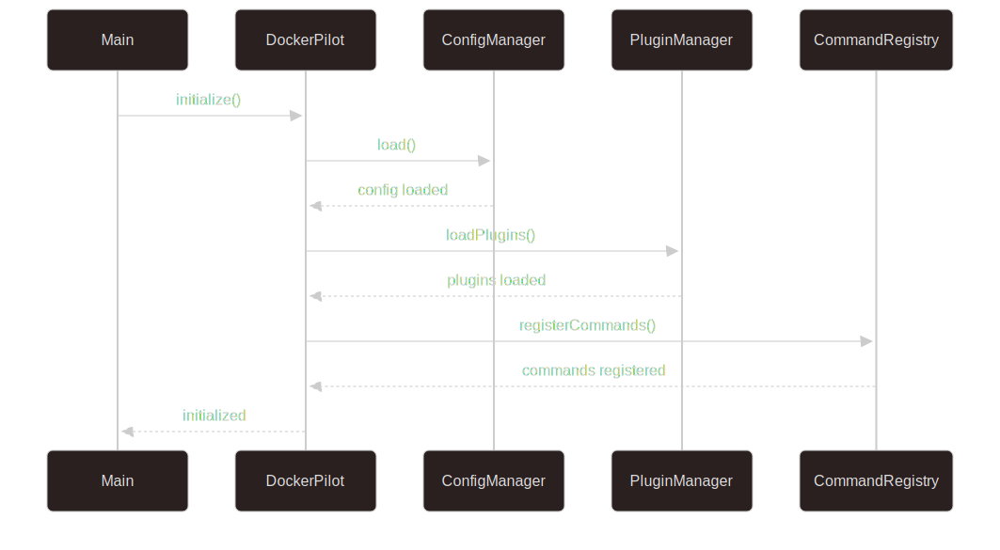
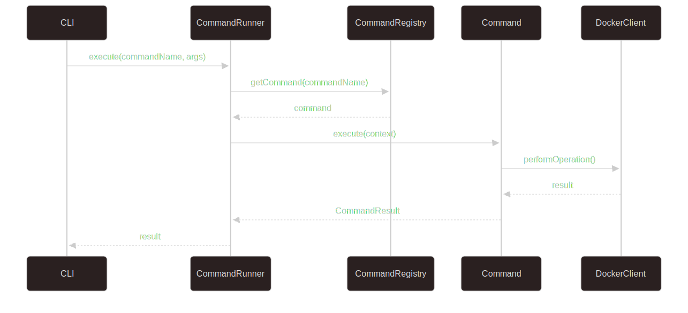
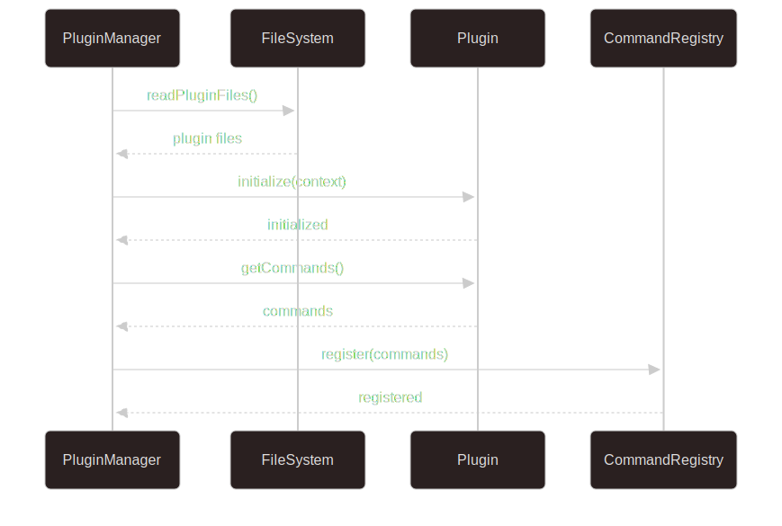

# Docker Pilot Architecture

This document describes the overall architecture of Docker Pilot, its main components and how they interact with each other.

## Overview

Docker Pilot is a CLI application built in TypeScript that provides a simplified and intuitive interface for managing Docker resources. The architecture is modular, extensible and follows clean design principles.

## Architectural Principles

### 1. Modularity
- Well-defined and independent components
- Low coupling between modules
- High cohesion within modules

### 2. Extensibility
- Plugin system for custom functionality
- Well-defined interface for extensions
- Hooks to intercept operations

### 3. Testability
- Dependency inversion
- Well-defined mocks and interfaces
- Clear separation between logic and infrastructure

### 4. Configurability
- Flexible configuration via files and environment variables
- Different profiles for different environments
- Robust configuration validation

## High-Level Architecture



## Main Components

### 1. Core Engine (DockerPilot)

The application core that coordinates all other components.

```typescript
class DockerPilot {
  private commandRunner: CommandRunner;
  private configManager: ConfigManager;
  private serviceManager: ServiceManager;
  private pluginManager: PluginManager;

  async initialize(): Promise<void>;
  async run(args: string[]): Promise<void>;
  async shutdown(): Promise<void>;
}
```

**Responsibilities:**
- Application initialization
- Component coordination
- Lifecycle management
- Global error handling

### 2. Command System

System responsible for defining, registering and executing commands.

```typescript
interface Command {
  name: string;
  description: string;
  category: CommandCategory;
  execute(context: CommandContext): Promise<CommandResult>;
}

class CommandRunner {
  private registry: CommandRegistry;

  async execute(commandName: string, args: string[]): Promise<CommandResult>;
  async executeInteractive(): Promise<void>;
}
```

**Components:**
- **CommandRegistry**: Centralized command registry
- **CommandRunner**: Command executor
- **CommandContext**: Execution context
- **CommandValidator**: Argument validation

### 3. Docker Integration

Docker Engine integration layer.

```typescript
class DockerClient {
  async listContainers(options?: ListOptions): Promise<Container[]>;
  async createContainer(options: CreateOptions): Promise<string>;
  async startContainer(id: string): Promise<void>;
  // ... other methods
}

class DockerUtils {
  static async isDockerRunning(): Promise<boolean>;
  static async getDockerVersion(): Promise<string>;
  static parseDockerfile(path: string): DockerInstruction[];
}
```

**Components:**
- **DockerClient**: Docker API client
- **DockerUtils**: Docker utilities
- **ResourceManagers**: Specific managers (Container, Image, etc.)

### 4. Configuration Management

Configuration management system.

```typescript
class ConfigManager {
  private config: DockerPilotConfig;

  async load(): Promise<void>;
  async save(): Promise<void>;
  get<T>(key: string): T;
  set<T>(key: string, value: T): void;
  validate(): ValidationResult;
}
```

**Features:**
- Multiple configuration sources
- Schema validation
- Hierarchical configuration
- Hot reload of configurations

### 5. Plugin System

Extensible plugin system.

```typescript
interface Plugin {
  name: string;
  version: string;
  initialize(context: PluginContext): Promise<void>;
  getCommands?(): Command[];
  getHooks?(): PluginHooks;
}

class PluginManager {
  async loadPlugin(pluginPath: string): Promise<void>;
  async unloadPlugin(pluginName: string): Promise<void>;
  getLoadedPlugins(): Plugin[];
}
```

**Features:**
- Dynamic loading
- Plugin isolation
- Well-defined API
- Hooks for extensibility

## Data Flow

### 1. Initialization



### 2. Command Execution



### 3. Plugin Loading



## Design Patterns Used

### 1. Command Pattern
Each operation is encapsulated as a command, allowing:
- Decoupling between invoker and receiver
- Easy addition of new commands
- Undo/redo support (future)
- Logging and auditing of operations

### 2. Strategy Pattern
For different execution and formatting strategies:
```typescript
interface OutputFormatter {
  format(data: any): string;
}

class TableFormatter implements OutputFormatter {
  format(data: any): string {
    // implementation
  }
}

class JsonFormatter implements OutputFormatter {
  format(data: any): string {
    return JSON.stringify(data, null, 2);
  }
}
```

### 3. Observer Pattern
For event system and hooks:
```typescript
class EventBus {
  private listeners: Map<string, EventHandler[]> = new Map();

  on(event: string, handler: EventHandler): void;
  emit(event: string, data: any): void;
  off(event: string, handler: EventHandler): void;
}
```

### 4. Factory Pattern
For creating complex objects:
```typescript
class CommandFactory {
  static create(type: CommandType, options: CommandOptions): Command {
    switch (type) {
      case 'container': return new ContainerCommand(options);
      case 'image': return new ImageCommand(options);
      default: throw new Error(`Unknown command type: ${type}`);
    }
  }
}
```

### 5. Dependency Injection
For inversion of control:
```typescript
class ContainerManager {
  constructor(
    private dockerClient: DockerClient,
    private logger: Logger,
    private validator: Validator
  ) {}
}
```

## Directory Structure

```
src/
├── core/                   # Main components
│   ├── DockerPilot.ts     # Main application class
│   ├── CommandRunner.ts   # Command executor
│   ├── ConfigManager.ts   # Configuration manager
│   └── ServiceManager.ts  # Service manager
├── commands/              # Command implementations
│   ├── base/              # Base classes for commands
│   ├── container/         # Container commands
│   ├── image/             # Image commands
│   ├── volume/            # Volume commands
│   ├── network/           # Network commands
│   └── compose/           # Compose commands
├── docker/                # Docker integration
│   ├── DockerClient.ts    # Docker client
│   ├── managers/          # Resource managers
│   └── utils/             # Docker utilities
├── plugins/               # Plugin system
│   ├── PluginManager.ts   # Plugin manager
│   ├── PluginLoader.ts    # Plugin loader
│   └── types.ts           # Plugin types
├── config/                # Configuration management
│   ├── ConfigLoader.ts    # Configuration loader
│   ├── ConfigValidator.ts # Configuration validator
│   └── defaults.ts        # Default configurations
├── utils/                 # General utilities
│   ├── Logger.ts          # Logging system
│   ├── FileUtils.ts       # File utilities
│   ├── ValidationUtils.ts # Validation utilities
│   └── ProcessUtils.ts    # Process utilities
├── types/                 # Type definitions
│   ├── index.ts           # Main exports
│   ├── docker.ts          # Docker types
│   ├── commands.ts        # Command types
│   └── config.ts          # Configuration types
├── ui/                    # User interface
│   ├── InteractiveMenu.ts # Interactive menu
│   ├── formatters/        # Output formatters
│   └── components/        # UI components
└── index.ts               # Entry point
```

## State Management

### 1. Configuration State
```typescript
interface ConfigState {
  docker: DockerConfig;
  ui: UIConfig;
  plugins: PluginConfig;
  logging: LoggingConfig;
}
```

### 2. Runtime State
```typescript
interface RuntimeState {
  currentCommand: string | null;
  loadedPlugins: Plugin[];
  dockerConnection: ConnectionState;
  interactiveMode: boolean;
}
```

### 3. Cache State
```typescript
interface CacheState {
  containers: Map<string, Container>;
  images: Map<string, Image>;
  volumes: Map<string, Volume>;
  networks: Map<string, Network>;
  lastUpdate: Date;
}
```

## Error Handling

### Error Hierarchy

```typescript
abstract class DockerPilotError extends Error {
  abstract code: string;
  abstract level: ErrorLevel;
}

class DockerConnectionError extends DockerPilotError {
  code = 'DOCKER_CONNECTION_ERROR';
  level = ErrorLevel.FATAL;
}

class CommandNotFoundError extends DockerPilotError {
  code = 'COMMAND_NOT_FOUND';
  level = ErrorLevel.ERROR;
}

class ValidationError extends DockerPilotError {
  code = 'VALIDATION_ERROR';
  level = ErrorLevel.WARNING;
}
```

### Error Handling Strategy

```typescript
class ErrorHandler {
  handle(error: Error, context: ErrorContext): void {
    if (error instanceof DockerPilotError) {
      this.handleKnownError(error, context);
    } else {
      this.handleUnknownError(error, context);
    }
  }

  private handleKnownError(error: DockerPilotError, context: ErrorContext): void {
    switch (error.level) {
      case ErrorLevel.FATAL:
        this.logger.fatal(error.message, error);
        process.exit(1);
      case ErrorLevel.ERROR:
        this.logger.error(error.message, error);
        throw error;
      case ErrorLevel.WARNING:
        this.logger.warn(error.message, error);
        break;
    }
  }
}
```

## Performance and Optimization

### 1. Lazy Loading
- Plugins are loaded on demand
- Commands are initialized only when needed
- Docker resources are cached when appropriate

### 2. Connection Pooling
```typescript
class DockerConnectionPool {
  private pool: DockerClient[] = [];
  private maxConnections = 5;

  async getConnection(): Promise<DockerClient> {
    if (this.pool.length > 0) {
      return this.pool.pop()!;
    }
    return new DockerClient();
  }

  releaseConnection(client: DockerClient): void {
    if (this.pool.length < this.maxConnections) {
      this.pool.push(client);
    }
  }
}
```

### 3. Caching Strategy
```typescript
class ResourceCache {
  private cache = new Map<string, CacheEntry>();
  private ttl = 30000; // 30 seconds

  get<T>(key: string): T | null {
    const entry = this.cache.get(key);
    if (!entry || Date.now() - entry.timestamp > this.ttl) {
      this.cache.delete(key);
      return null;
    }
    return entry.value;
  }

  set<T>(key: string, value: T): void {
    this.cache.set(key, {
      value,
      timestamp: Date.now()
    });
  }
}
```

## Security

### 1. Input Validation
```typescript
class InputValidator {
  validateContainerName(name: string): ValidationResult {
    const pattern = /^[a-zA-Z0-9][a-zA-Z0-9_.-]*$/;
    if (!pattern.test(name)) {
      return {
        valid: false,
        errors: ['Invalid container name']
      };
    }
    return { valid: true, errors: [] };
  }
}
```

### 2. Command Sanitization
```typescript
class CommandSanitizer {
  sanitize(command: string): string {
    // Remove dangerous characters
    return command.replace(/[;&|`$()]/g, '');
  }

  validateDockerCommand(command: string[]): boolean {
    const allowedCommands = ['ps', 'images', 'volume', 'network'];
    return allowedCommands.includes(command[0]);
  }
}
```

### 3. Permission Checking
```typescript
class PermissionChecker {
  async canAccessDocker(): Promise<boolean> {
    try {
      await this.dockerClient.ping();
      return true;
    } catch {
      return false;
    }
  }

  async canWriteToPath(path: string): Promise<boolean> {
    try {
      await fs.access(path, fs.constants.W_OK);
      return true;
    } catch {
      return false;
    }
  }
}
```

## Extensibility

### 1. Plugin Architecture
```typescript
interface PluginAPI {
  registerCommand(command: Command): void;
  registerHook(event: string, handler: EventHandler): void;
  getConfig(): DockerPilotConfig;
  getLogger(): Logger;
  getDockerClient(): DockerClient;
}
```

### 2. Hook System
```typescript
class HookSystem {
  private hooks = new Map<string, EventHandler[]>();

  register(event: string, handler: EventHandler): void {
    if (!this.hooks.has(event)) {
      this.hooks.set(event, []);
    }
    this.hooks.get(event)!.push(handler);
  }

  async trigger(event: string, data: any): Promise<void> {
    const handlers = this.hooks.get(event) || [];
    await Promise.all(handlers.map(handler => handler(data)));
  }
}
```

### 3. Custom Commands
```typescript
abstract class CustomCommand implements Command {
  abstract name: string;
  abstract description: string;
  abstract category: CommandCategory;

  async execute(context: CommandContext): Promise<CommandResult> {
    try {
      await this.preExecute(context);
      const result = await this.doExecute(context);
      await this.postExecute(context, result);
      return result;
    } catch (error) {
      await this.onError(context, error as Error);
      throw error;
    }
  }

  protected async preExecute(context: CommandContext): Promise<void> {}
  protected abstract doExecute(context: CommandContext): Promise<CommandResult>;
  protected async postExecute(context: CommandContext, result: CommandResult): Promise<void> {}
  protected async onError(context: CommandContext, error: Error): Promise<void> {}
}
```

## Testing Architecture

### 1. Test Structure
```
tests/
├── unit/                  # Unit tests
│   ├── core/             # Core tests
│   ├── commands/         # Command tests
│   ├── utils/            # Utility tests
│   └── plugins/          # Plugin tests
├── integration/          # Integration tests
│   ├── docker/           # Docker integration
│   ├── commands/         # End-to-end commands
│   └── plugins/          # End-to-end plugins
├── e2e/                  # End-to-end tests
│   ├── cli/              # CLI interface
│   └── scenarios/        # Complete scenarios
├── fixtures/             # Test data
│   ├── containers/       # Container configurations
│   ├── images/           # Image definitions
│   └── configs/          # Test configurations
└── helpers/              # Test utilities
    ├── mocks/            # Mocks and stubs
    ├── setup/            # Environment setup
    └── assertions/       # Custom assertions
```

### 2. Test Utilities
```typescript
class TestEnvironment {
  static async setup(): Promise<void> {
    // Setup Docker test environment
    await DockerTestHelper.createTestNetwork();
    await DockerTestHelper.pullTestImages();
  }

  static async teardown(): Promise<void> {
    // Cleanup test environment
    await DockerTestHelper.removeTestContainers();
    await DockerTestHelper.removeTestNetwork();
  }
}
```

## Deployment Architecture

### 1. Build Process
```typescript
// build.config.ts
export default {
  entry: './src/index.ts',
  output: {
    dir: './dist',
    format: 'cjs'
  },
  external: ['docker-cli-js', 'inquirer'],
  plugins: [
    typescript(),
    nodeResolve(),
    commonjs()
  ]
};
```

### 2. Distribution
- **npm package**: For npm installation
- **Docker image**: For container execution
- **Binary executables**: For different platforms
- **GitHub releases**: For direct download

### 3. Monitoring
```typescript
class TelemetryCollector {
  async collectUsageData(): Promise<UsageData> {
    return {
      commandsExecuted: this.getCommandStats(),
      errorRates: this.getErrorStats(),
      performance: this.getPerformanceStats(),
      features: this.getFeatureUsage()
    };
  }
}
```

## Architecture Evolution

### Future Versions

1. **v2.0**:
   - Multi Docker host support
   - Optional web interface
   - Cluster management

2. **v3.0**:
   - Kubernetes integration
   - Cloud provider plugins
   - Advanced monitoring

3. **v4.0**:
   - AI-powered optimization
   - Automated troubleshooting
   - Infrastructure as Code

### Migration Strategy
```typescript
class MigrationManager {
  async migrateConfig(fromVersion: string, toVersion: string): Promise<void> {
    const migrations = this.getMigrations(fromVersion, toVersion);
    for (const migration of migrations) {
      await migration.execute();
    }
  }
}
```

This architecture provides a solid and extensible foundation for Docker Pilot, allowing continuous growth and evolution while maintaining the simplicity and usability that are the project's pillars.
